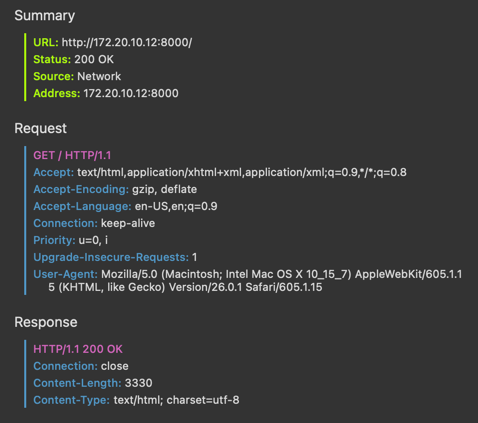

# PR Lab 1 – HTTP File Server Report

**Student:** Alexei Pavlovschii, FAF-231
**Course:** Network Programming (PR)  
**Instructor:** Artiom Balan  
**Deadline:** Oct 14, 2025  
**Repository:** [GitHub Link](https://github.com/AlexDandy77/NP-FAF-Labs/)

---

## 1. The Task

Implement an HTTP File server using **raw TCP sockets** that:
- Handles one HTTP request at a time.
- Serves files from a chosen directory (`.html`, `.png`, `.pdf`).
- Returns a **404 custom page** for missing or unsupported files.
- Provides directory listings for nested folders.
- Runs inside **Docker** using **Docker Compose**.
- Includes a simple **Python client** for testing.

---

## 2. Project Structure

```
lab1-http/
├── server.py           # HTTP server
├── client.py           # HTTP client
├── Dockerfile          # Container definition
├── docker-compose.yml  # Run configuration
├── REPORT.md           # This report
└── www/                # Content directory
    ├── index.html
    ├── 404.html
    ├── subdir/info.html
    ├── images/sample.png
    └── books/
        ├── crypto/crypto.pdf
        ├── book1.pdf
        └── book2.pdf
```
---

## 3. Running Locally (No Docker)

### Command
```bash
python server.py ./www
```

### Screenshot – server start


Shows the HTTP server starting up and listening on port 8080

### Screenshot – directory listing


Displays the contents of the root directory with files and folders

### Screenshot – browser request (index.html)


Shows the main index.html page being served in the browser

### Screenshot – subdirectory listing (books)


Lists the contents of the books subdirectory containing PDF files

### Screenshot – opening a .pdf file


Demonstrates opening and viewing a file from the server

### Screenshot – opening a .png file


Shows opening and viewing a photo from the server

### Screenshot – 404 page


Shows the custom 404 error page when requesting a non-existent file

---

## 4. Docker Setup

### Dockerfile
```dockerfile
FROM python:3.12-slim
WORKDIR /app
COPY server.py client.py /app/
COPY www /app/www
EXPOSE 8080
ENV PORT=8080
CMD ["python", "server.py", "/app/www"]
```

### docker-compose.yaml
```docker
services:
  web:
    build: .
    command: ["python", "server.py", "/app/www"]
    ports:
      - "8080:8080"
    environment:
      - PORT=8080
    volumes:
      - ./www:/app/www:ro
    restart: unless-stopped
```

### Build and run with Docker Compose
```bash
docker compose up --build
```
Compose uses the command: `["python","server.py","/app/www"]`, so the server runs with `/app/www` as the served directory.

### Plain Docker - Alternative Approach
```bash
docker build -t pr-lab1 .
docker run --rm -p 8080:8080 -v "$(pwd)/www:/app/www:ro" pr-lab1 python server.py /app/www
```
Here you explicitly pass `/app/www` as the argument that points to the mounted folder.

### Screenshot – container start


Shows Docker container starting up successfully with the HTTP server listening on port 8080

### Screenshot – browser access at http://localhost:8080


Demonstrates accessing the HTTP server through a web browser after Docker container deployment

---

## 5. Client Tests

### Download a file with client.py:
```bash
python client.py http://127.0.0.1:8080/books/book1.pdf ./downloads
```

### Screenshot – file saved


### Open a .html file with client.py: 
```bash
python client.py http://127.0.0.1:8080/index.html ./downloads
```
### Screenshot – displayed html content


---

## 6. Browsing friend's server
**Friend**: Victoria Mutruc, FAF-232

### Network setup
1. Both machines on the same LAN. 
2. Friend ran the same server on his machine (port 8080). 
3. We ensured local firewalls allowed inbound connections on 8080.

### Further process
- Found his IP by running `ipconfig getifaddr en0` in macOS terminal.
- Accessed the server by opening: `http://<friends-ip-address>>:8080/`
- Playing around and viewing the website.

### Screenshot - Network Request (Browser)

This shows the network request at friend's server

### Screenshot - Content of the server

The content of the friend's server displayed in the browser

### Screenshot - Save picture using client script

The terminal output of saving the photo

### Screenshot - Client request configuration

The configuration of running client script to friend's server

---

## 7. Key Components

| Component | Purpose |
|------------|----------|
| `server.py` | Handles incoming TCP connections, parses GET requests, sends files or directory listings. |
| `client.py` | Connects to server, downloads files or prints HTML body. |
| `Dockerfile` | Defines how to build a Python-based container. |
| `docker-compose.yml` | Describes how to run and expose the container. |
| `404.html` | Custom page for missing resources. |
| `SO_REUSEADDR` | Allows server restart on same port immediately. |
---
> The project demonstrates practical understanding of TCP sockets, HTTP fundamentals, and Docker workflow.
