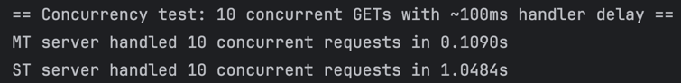

# PR Lab 2 – Concurrent HTTP File Server Report

**Student:** Alexei Pavlovschii, FAF-231  
**Course:** Network Programming (PR)  
**Instructor:** Artiom Balan  
**Deadline:** Oct 21, 2025  
**Repository:** [GitHub Link](https://github.com/AlexDandy77/NP-FAF-Labs/)

---
## 1. Overview

This lab extends the single-threaded HTTP server from Lab 1 to a multithreaded version, capable of handling multiple client requests simultaneously.
The goal is to compare single-threaded and concurrent performance, implement safe counters, and demonstrate rate limiting per IP.


## 2. Objectives

1.	**Concurrency:** Make the HTTP server handle multiple connections using threads. 
2.  **Counter Race:** Record the number of requests per file and show how race conditions appear and are fixed.
3.	**Rate Limiting:** Restrict requests per IP (e.g., `5 requests/second`).
---

## 3. Project Structure

```
lab2_concurrent_http/
├── server_mt.py        # Multithreaded HTTP server
├── bench.py            # Benchmark script
├── Dockerfile          # Container definition
├── docker-compose.yml  # Run configuration
├── screenshots/        # Screenshots for report
└── REPORT.md           # This report
```

---

## 4. Running Locally (No Docker)

### Optionally - set `.env` variables
```bash
DELAY_MS = 0    # 0 = no delay, 1000 = 1 second delay
USE_LOCK = 1    # 0 = naive (racey), 1 = fixed
RATE_LIMIT = 5  # ~5 req/sec per client IP
WINDOW_SEC = 1  # sliding window in seconds
```

### Startup Command
```bash
cd lab2_concurrent_http
python server_mt.py ../lab1_http/www
```

### Screenshot – server start

Shows the concurrent HTTP server starting up with the default configuration parameters (lock status, rate limit, delay) and listening on port 8080.

### Screenshot – directory listing


Displays the contents of the root directory with files, folders, as well as the `Hits` counter of every entry.

---

## 5. Docker Setup

### Dockerfile
```dockerfile
FROM python:3.11-slim
WORKDIR /app
COPY . /app
EXPOSE 8080
ENV HOST=0.0.0.0 PORT=8080 USE_LOCK=1 RATE_LIMIT=5 WINDOW_SEC=1.0 PYTHONPATH=/app
CMD ["python", "lab2_concurrent_http/server_mt.py", "lab1_http/www"]
```

### docker-compose.yaml
```docker
services:
  webserver:
    build:
      context: ..
      dockerfile: lab2_concurrent_http/Dockerfile
    working_dir: /app
    ports:
      - "8080:8080"
    environment:
      HOST: "0.0.0.0"
      PORT: "8080"
      USE_LOCK: "1"
      RATE_LIMIT: "5"
      WINDOW_SEC: "1.0"
      PYTHONPATH: "/app"
    volumes:
      - ..:/app
    command: ["python", "lab2_concurrent_http/server_mt.py", "lab1_http/www"]
```

### Build and run with Docker Compose
```bash
docker compose up --build
```
Compose uses the command: `["python", "lab2_concurrent_http/server_mt.py", "lab1_http/www"]`, so the server runs with `lab1_http/www` as the served directory.

### Screenshot – container start


Shows the Docker container starting up successfully with the concurrent HTTP server listening on port 8080.

### Screenshot – browser access at http://localhost:8080/images/


Demonstrates accessing the concurrent HTTP server through a web browser after Docker container deployment.

---

## 6. Benchmark Script
### 6.1 CLI commands and flags

#### Command: concurrency

| Short | Long       | Argument | Description                                    |
|------:|------------|----------|------------------------------------------------|
| -n    | --num      | int      | Concurrent requests (default 10)               |
|       | --delay-ms | int      | Artificial per-request delay in ms (default 100) |

#### Command: counter

| Short | Long   | Argument | Description                                        |
|------:|--------|----------|----------------------------------------------------|
| -n    | --num  | int      | Concurrent requests to send (default 200)          |
|       | --path | str      | File path to target (default /books/)              |

#### Command: ratelimit

| Short | Long       | Argument | Description                             |
|------:|------------|----------|-----------------------------------------|
| -d    | --duration | float    | Test duration seconds (default 10.0)    |
|       | --limit    | int      | Rate limit per second (default 5)       |

### 6.2 Concurrency Test
```bash
cd lab2_concurrent_http
python bench.py concurrency
```

### Output:


### 6.3 Counter Test
```bash
cd lab2_concurrent_http
python bench.py counter
```

### Output:


### 6.4 Rate Limiting Test
```bash
cd lab2_concurrent_http
python bench.py ratelimit
`````

### Output:


---

## 7. Key Components

| Component            | Purpose                                                                                                                                 |
|----------------------|-----------------------------------------------------------------------------------------------------------------------------------------|
| `server_mt.py`       | Concurrent version of server from lab 1, creates a thread for every request.                                                            |
| `bench.py`           | A benchmark that is testing the MT(multithreaded) vs ST(single-threaded) servers in 3 conditions: Concurrency, Counter, and Rate-limit. |
| `Dockerfile`         | Defines how to build a Python-based container.                                                                                          |
| `docker-compose.yml` | Describes how to run and expose the container.                                                                                          |

---
> This project shows the performance of a concurrent HTTP server, and demonstrates the use of rate-limiting and counters.


